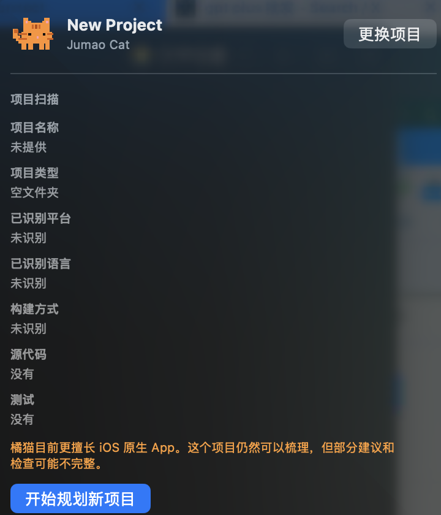
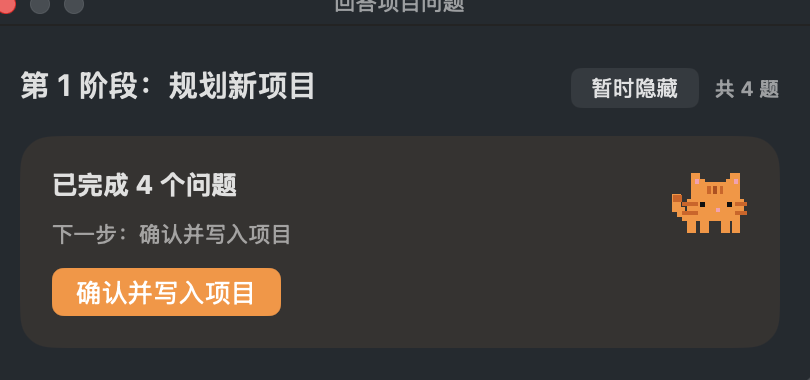

# Jumao Cat

[简体中文](README.zh-CN.md)

Jumao helps turn a vague app idea—or a planned change to an existing project—into project material, boundaries, and a next step that an AI coding tool can read first. It does not automatically build a complete app; it first makes the requirements, scope, screen states, and data boundaries clear.



## Download Jumao Cat

[**Download Jumao Cat for macOS**](https://github.com/smianmian/jumao/releases/latest)

> **Early preview:** Jumao Cat v0.3.0 focuses on project inspection, requirement intake, and setting boundaries before AI-assisted development. One-click planning, Agent execution, and complete task-package workflows are still being developed.

Current support:

- macOS 14 or later
- Apple silicon Macs (arm64)
- Developer ID signed and Apple notarized
- App users do not need Node.js, Homebrew, npm, or a global Jumao install

Download the ZIP, unzip it, move `Jumao Cat.app` to Applications, and open it from Applications.

## For a new project

1. Choose an empty folder, or a folder you want to use for planning.
2. Click **Start planning a new project**.
3. Answer four questions: the project, core features, current goal, and target platform.



In v0.3.0, those answers are saved to `.jumao/intake-answers.json`. This is a first structured intake. It does not create an Xcode, web, or app source project, and it does not automatically finish a full project plan.

## For an existing project

1. Choose an existing code project.
2. Jumao Cat performs a read-only inspection of visible platform, language, build, source, and test signals.
3. Click **Start planning this change**, then answer what you want to change, what is blocking you, and what must not break.

The existing-project questionnaire carries the read-only inspection result so it does not ask again about facts it can already see. Inspection and the first intake do not modify source code; any later write or development action requires your explicit decision.

## v0.3.0 capability boundaries

- Provides first-round intake for new and existing projects and saves structured answers.
- Runs read-only `inspect` for existing projects.
- Restores unfinished interview drafts.
- Bundles Jumao CLI and Node.js runtime, so the app does not depend on a system development environment.
- Does not automatically generate a complete app, publish anything, or replace product, compliance, or release decisions.

For complete planning files and a task package, use the advanced CLI flow below. `jumao new` creates a **project planning workspace** with planning documents and templates; it does not create an Xcode, website, or app source project.

## Agent groups: what is real today

Jumao currently has **8 registered Agent groups and 44 registered Agent definitions**: direction and ownership, product and design, technology and development, data and privacy, compliance and health claims, platform qualification, revenue and operations, and release and incidents.

They are rules and review perspectives—not 44 autonomous agents already performing development work.

- **Registered:** the repository defines groups, trigger conditions, guidance, and guardrails.
- **Matched:** `doctor --write` matches possible agents from answers provided by the project owner and writes a report, rules, and a status summary.
- **Produced:** only the written governance report, rules, and status files are actual outputs.
- **Not happening automatically:** agents do not write code, call external services, complete reviews, or declare a project ready for release.

See the [full Agent guide](docs/agents.zh-CN.md) for the complete list.

## Advanced CLI use

Run the following commands yourself in a **system terminal**. Do not ask Codex, Claude, or Cursor to answer the interactive `jumao interview` questions for you; the person who understands the project should answer them.

```bash
npm install -g jumao

mkdir -p ~/jumao-work
cd ~/jumao-work
jumao new "My App" --dir ./my-app
jumao interview ./my-app
jumao check ./my-app --strict
jumao audit ./my-app --write
jumao pack ./my-app --target codex
```

`./my-app` is your own planning-workspace directory. After the complete CLI interview, Jumao can create or update these real planning artifacts:

- `product/product-brief.zh-CN.md`
- `product/scope-gate.zh-CN.md`
- `product/screen-states.zh-CN.md`
- `product/data-safety.zh-CN.md`
- `proof/release-proof.zh-CN.md`
- `tasks/codex-task-pack.md` (after `pack --target codex`)

### Handing the plan to Codex

The recommended approach is to open the real project folder in the Codex app and tell Codex:

```text
Please read these project files first:
- AGENTS.md
- product/
- proof/
- tasks/codex-task-pack.md

First summarize the goal, scope, risks, and the smallest next task.
Do not modify code until I confirm.
```

If you genuinely need to copy between tools, you can instead run:

```bash
cat ./my-app/tasks/codex-task-pack.md | pbcopy
```

This only copies file contents to the clipboard and shows no output. It is not the primary handoff flow.

The example `doctor-answers.json` is only for repository tests. Never use it as answers for a real project.

## Developer documentation and contributing

- [Guide](docs/guide.md)
- [Agent guide](docs/agents.zh-CN.md)
- [Publishing checklist](docs/publish-checklist.md)
- [Changelog](CHANGELOG.md)
- [Contributing](CONTRIBUTING.md)
- [简体中文 README](README.zh-CN.md)
