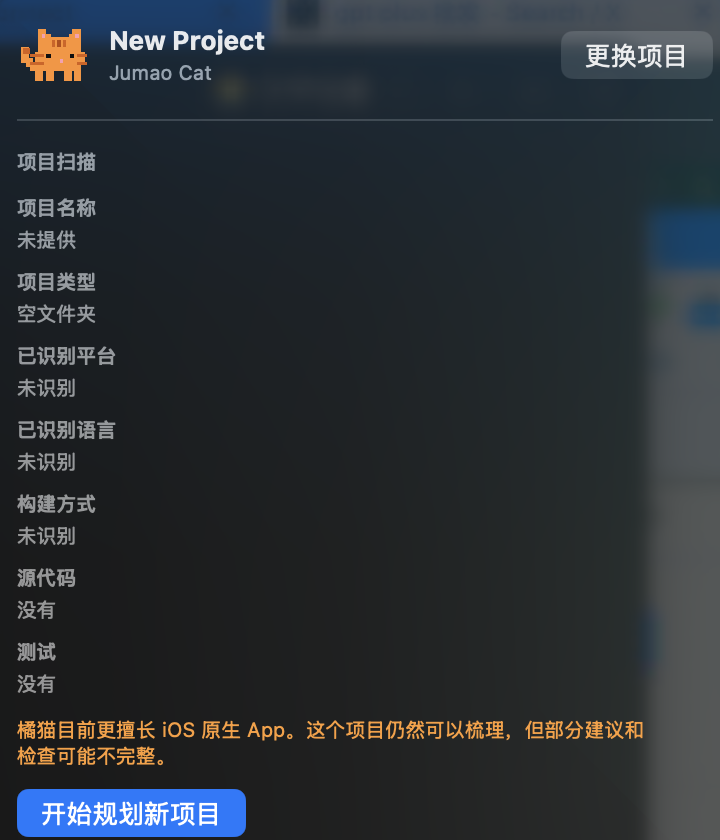

# Jumao Cat

[简体中文](README.zh-CN.md)

**Preview · [v0.4.0-rc.2](https://github.com/smianmian/jumao/releases/tag/v0.4.0-rc.2)**

## What is Jumao?

You do not need to write code yourself to ship an app idea with AI.

**Jumao Cat** helps you turn a product idea — or one change to an existing project —
into a clear, evidence-backed plan. You then hand that plan to an AI coding tool
(Codex, Claude Code, Cursor, and similar) so it builds what you actually meant.

AI is great at typing code. It is weaker at staying on scope, saying what this
version will **not** do, and proving work is finished. Jumao is the step **before**
coding: sort the idea, check the project, write a plan the AI can follow.

Jumao runs **on your Mac / machine**. It does not call cloud AI APIs for planning,
does not silently rewrite your product code, and does not publish the app for you.



## Why people use it

| Without Jumao | With Jumao |
|---------------|------------|
| “Build me an app” → AI invents features | You answer a few plain questions first |
| Scope grows every chat | Boundaries and “do not build this yet” are explicit |
| “Done” with no proof | Plan + optional completion check after the AI works |
| You re-explain the project every time | Jumao reuses what it can see in the project folder |

## Install (v0.4.0-rc.2 Preview)

### macOS app (recommended if you are not living in a terminal)

[**Download Jumao Cat v0.4.0-rc.2 Preview**](https://github.com/smianmian/jumao/releases/tag/v0.4.0-rc.2)

1. Download `JumaoCat-v0.4.0-rc.2-arm64.zip`
2. Unzip → drag `Jumao Cat.app` into **Applications**
3. Open it from **Applications** (not from the ZIP window)

Requirements: macOS 14+, Apple silicon (arm64). Signed and notarized. No Node.js
install needed for the app.

### Terminal (CLI)

```bash
npm install -g jumao@rc
```

That installs this Preview line (`0.4.0-rc.2` via the `rc` tag).

Older releases (for example v0.3.1) stay on GitHub for history only. **New users
should start on v0.4.0-rc.2**, not the old line.

## First use in five minutes

1. **Open Jumao Cat** and choose a folder  
   - Empty folder = new idea  
   - Existing code folder = “change this project”
2. **Answer a few ordinary questions**  
   - New: what is it, what should it do, where do you use it first?  
   - Optional: what this version must **not** do  
   - Existing project: what should this change become?
3. **Confirm** Jumao understood you. It then prepares a development plan locally.
4. **Review** the plan (what to do first, what to protect, what is blocked).
5. **Hand to your AI coding tool**  
   - In the app: **Hand to Codex** (or copy the instruction for Claude / Cursor)  
   - Open the **same** folder in that tool and paste the instruction  
6. **Let the AI implement** inside that folder. When it finishes, you can ask Jumao
   to check the completion story (CLI: `jumao verify` on projects you trust).

More detail: **[Getting started](docs/getting-started.md)**.


## From idea to AI development

```text
  Your idea / change
         │
         ▼
  Jumao (local plan + boundaries)
         │
         ▼
  Plan file you can open and read
         │
         ▼
  AI coding agent (Codex / Claude / Cursor)
         │
         ▼
  Code + optional completion check
```

Jumao is the **decision and delivery control layer** in front of the AI coding
agent: what is in scope, what is out, what “done” means, and what to protect.
The agent still writes the code; you still decide release, payment, and real-user
actions.

How that works under the hood (for builders):  
**[How Jumao works](docs/concepts/how-jumao-works.md)**.

## Safety in one line

Planning is local and read-only on your source by default. Notes go under
`.jumao/`. The plan you hand off is usually `tasks/jumao-agent-plan.md`. Jumao
does not charge users, publish apps, or call AI APIs for you.

## For developers (CLI)

Same product, terminal workflow:

```bash
npm install -g jumao@rc

jumao plan /path/to/project
jumao plan /path/to/project --json
jumao plan /path/to/project --force
jumao verify /path/to/project
jumao verify /path/to/project --no-run-checks   # no project test execution
```

`jumao verify` may re-run the project’s own tests. Use it only on code you trust;
prefer `--no-run-checks` for a static look at receipts and files.

Also available: `interview`, `doctor`, `new`, `inspect`, `check`, `audit`,
`pack`, `status`.

## Documentation

| Audience | Doc |
|----------|-----|
| First run | [Getting started](docs/getting-started.md) |
| Product idea | [How Jumao works](docs/concepts/how-jumao-works.md) |
| Extra product templates | [Guide](docs/guide.md) |
| This Preview’s changes | [Changelog](CHANGELOG.md) |
| Contributing | [CONTRIBUTING.md](CONTRIBUTING.md) |

## License

MIT — [LICENSE](LICENSE).
