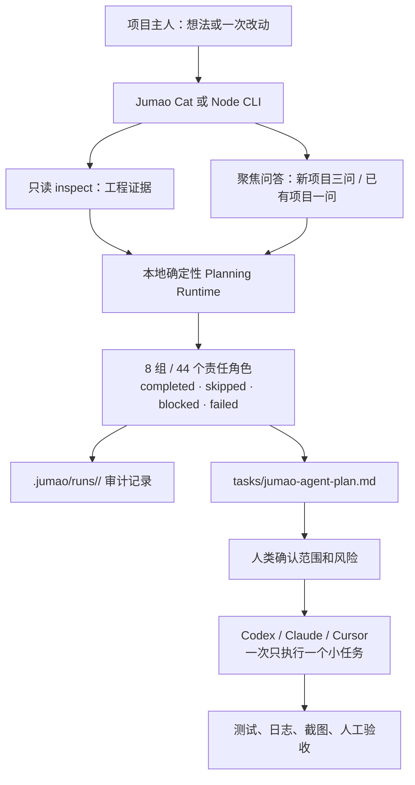

# Jumao（橘猫）完整项目说明与评估材料

> 用途：把本文件完整交给 GPT、技术顾问、投资/产品评审者或新的开发 Agent，用于理解、评估、质疑和规划 Jumao。
>
> 快照日期：2026-07-23（Asia/Shanghai）  
> 仓库：`smianmian/jumao`  
> 当前分支：`codex/v0.4-agent-evidence`  
> 最近基线提交：`93d44fc0503124c88a571a97bbcad86c7514d96e`（2026-07-16，`chore: prepare v0.3.1 release`）  
> npm/CLI `package.json` 版本：`0.3.1`  
> macOS App marketing version：`0.3.1`  
> 重要说明：当前工作区包含尚未提交的 v0.4 开发改动；因此本文始终把“已发布基线”“当前工作区实现”和“已确认但尚未完成的规划”分开描述。除非有发布标签、构建产物或外部平台记录，不应声称任何内容已经上线、发包、签名、公证、提交审核或通过审核。

---

## 1. 一句话定义

Jumao（中文名“橘猫”）是一个**本地运行、无需模型 API、面向非程序员产品创作者的 AI 编程前规划与治理工具**。它把一个新产品想法，或已有项目的一次改动，整理为有边界、有证据、可交给 Codex / Claude / Cursor 等 AI 编程工具执行的小范围计划。

它不是自动写完整产品的 AI，也不是托管式项目管理 SaaS。核心价值在于：在 AI 开始改代码前，逼近并暴露“目标、首版范围、页面状态、数据边界、发布证据和人工确认点”，减少 AI 自行补需求、越权操作和“没有证据却宣称完成”的风险。

## 2. 要解决的问题

### 2.1 目标用户

- 不常写代码、但想把产品做出来的人。
- 使用 Codex、Claude Code、Cursor 或网页大模型辅助开发的人。
- 有一个新点子，或希望安全地改已有项目，但无法一次写出完整 PRD/技术方案的人。
- 特别适合需要防止 AI 擅自扩大需求、接入账号/支付/云服务、触碰发布或真实用户的使用场景。

### 2.2 核心痛点

1. 用户用一句模糊的自然语言描述需求时，AI 容易擅自补全功能、技术栈和架构。
2. 开发往往只实现“正常成功路径”，缺少空数据、失败、权限拒绝、删除和退款等状态。
3. 登录、同步、支付、健康、敏感数据、公开发布等能力会带来隐私、合规、测试和运营前置条件，但初学者通常很晚才意识到。
4. AI 或开发者常把“写了代码”误说成“已测试、已发布、已审核通过”。
5. 对已有项目，用户不希望重复回答代码库已经可以提供的事实；但也不希望工具偷偷读取密钥或遍历整个工程。

### 2.3 产品主张

- 先用普通人能回答的问题收集最少信息，再形成可执行计划。
- 本地、确定性、可审计：不依赖外部大模型 API，不要求 API Key 或 Jumao 账号。
- 默认扫描和规划只读业务代码；不会自动添加业务代码、部署、发布、收费、推送、打 tag 或操作外部账号。
- 当涉及真实用户、生产数据、付费、审核、上线或外部平台时，明确要求人类确认。
- 每次 AI 编码任务应尽量小，并要求给出测试、日志、截图或人工验收等完成证据。

## 3. 产品边界：做什么、不做什么

### 3.1 已纳入范围

- 创建或初始化带有产品治理文档的新工作区。
- 检查新/已有工作区的可见工程证据，识别平台、语言、构建系统、源码和测试存在与否。
- 用“新项目三问”或“已有项目一问”收集聚焦需求，并把答案保存在本地 JSON。
- 通过 44 个本地规则化“责任角色”生成可审计的规划结果。
- 生成面向 Codex、Claude、Cursor 的 Markdown 任务包。
- 对产品文档做基础完整性/占位符检查，生成审计报告和下一步安全任务。
- 提供 Node CLI，以及 macOS 14+ Apple Silicon 菜单栏 App（Jumao Cat）作为图形入口。

### 3.2 明确不在范围（当前产品承诺）

- 不直接调用 OpenAI 或任何外部 AI API。
- 不处理 API Key，也不提供托管账号或云端服务。
- 不作为自主编码 Agent，不自动实现业务代码。
- 不自动部署、发布、提交 App Store/TestFlight、收费、接入生产支付、npm 发布、git push 或 git tag。
- 不提供 Web UI。
- 不承诺 44 个责任角色等同于 44 位人类专家或 44 个独立模型的审查结论。
- 不把保守的关键词/文件证据匹配说成完整依赖图或完整安全审计。

### 3.3 非目标背后的取舍

Jumao 牺牲自动化速度，换取边界清晰和可复核性。它的角色是“让下一次 AI 编码更可靠的前置层”，而不是替代产品负责人、法务、安全专家、发布负责人或真正的软件工程实现。

## 4. 当前成熟度与版本状态

| 层面 | 事实 | 评估时应如何理解 |
| --- | --- | --- |
| 已发布基线 | `v0.3.1` Release Candidate；README 宣称提供 Agent Planning Runtime v1 和 Jumao Cat | 应以发布包、Git tag/Release 和构建证据进一步核验，不应仅凭 README 认定已正式商业发布 |
| 当前开发主线 | v0.4“Agent 证据与计划质量” | 处于开发中，不等于完成或发布 |
| 工作区变动 | `CHANGELOG.md`、`ROADMAP.md`、`docs/agents.zh-CN.md`、`src/core/planning-runtime.js`、`test/plan.test.js` 有改动，另有 v0.4 产品方案文档 | 这些改动应被代码评审和测试验证后才可视为新能力 |
| Node 技术基线 | ES module JavaScript、Node `>=18`、无第三方 npm 运行依赖 | 依赖面小，维护成本低；也意味着大量能力由自研规则实现 |
| macOS 技术基线 | Swift 6、SwiftUI/AppKit、macOS 14+、arm64 发布设置 | 平台明确，但当前对非 Apple 工程的产品理解能力有限 |

## 5. 用户可见流程

### 5.1 Jumao Cat 图形流程

1. 用户选择一个新文件夹或已有项目文件夹。
2. App 调用本地 CLI 进行只读检查，区分空文件夹、新项目资料、已有项目或无法判断的目录。
3. 新项目回答三题：想做什么、希望做哪些事、先在哪儿用；已有项目仅描述“这次想改成什么样”。
4. App 保存本地问答草稿，用户确认后写入 `.jumao/intake-answers.json`，并按情况生成不覆盖用户手写内容的初始文档。
5. App 运行 `jumao plan <workspace> --events-jsonl`，实时显示 8 个小组与 44 个角色的真实状态。
6. Runtime 写出规划记录和 `tasks/jumao-agent-plan.md`；App 监听 `.jumao/status.json` 后显示最新结果。
7. 用户查看计划，点击“交给 Codex”后，App 在 Codex 中打开相同工作区，并复制/提供对应启动指令。
8. Codex 仍需先复述目标和边界，等待用户确认后才修改代码。

### 5.2 CLI 工作流

早期稳定流程：

```text
new -> interview -> check --strict -> audit -> pack --target
```

规划 Runtime 流程：

```text
inspect -> interview（或由 Cat 写入 intake）-> plan -> 读取 tasks/jumao-agent-plan.md -> 人工确认 -> AI 小范围实现
```

### 5.3 端到端关系图



## 6. 系统组成与架构

### 6.1 仓库顶层结构

| 路径 | 内容与职责 |
| --- | --- |
| `bin/jumao.js` | Node CLI 的可执行入口 |
| `src/cli.js` | 命令路由、参数解析、模板初始化和 CLI 输出 |
| `src/core/` | 领域逻辑：扫描、访谈、校验、审计、角色注册、规划、任务包、状态 |
| `templates/` | 中英文产品/范围/页面状态/数据安全/发布证据/AI 任务包模板 |
| `checklists/` | Agent readiness 与发布证据检查表 |
| `docs/` | 使用指南、角色说明、阶段说明、提示词、发布清单和产品方案 |
| `examples/ai-note-helper/` | 可运行示例工作区和固定回答/证据 |
| `test/` | Node 内置测试框架的 CLI 和 Runtime 测试 |
| `apps/jumao-cat-mac/` | macOS 菜单栏应用、Xcode 工程、Swift 测试、打包/签名脚本 |
| `assets/jumao/` | CLI/README/App 可复用的橘猫 ASCII、SVG、PNG 和菜单栏状态图 |
| `AGENTS.md`、`CLAUDE.md` | 给 AI 编码工具的行为边界与交接指令 |

工作区统计（当前快照，`src`、macOS 源码/测试、Node 测试、模板、清单和文档中的主要文本/代码文件）约为 **23,099 行**。这只是规模指标，不是质量或完成度指标。

### 6.2 Node CLI 核心模块

| 模块 | 主要责任 |
| --- | --- |
| `inspect.js` | 有边界的只读目录检查，识别工程证据与未知项 |
| `interview.js` + `interview-schema.json` | 终端问答、读取回答 JSON、写入核心产品文件或 focused intake |
| `strict-check.js` + `validators.js` | 必需文件、空内容、占位符、低质量填写、表格/字段结构校验 |
| `audit.js` | 依据 strict 校验生成可读的缺口、原因、下一步安全任务和“暂不要做” |
| `doctor.js` | 根据问答做 Agent Review Board 诊断，并生成 `governance/` 文件（旧/补充流程） |
| `agent-registry.js` | 8 个组和 44 个责任角色的注册表、触发条件、门禁和用户解释 |
| `planning-runtime.js` | v0.3.1 起的本地确定性规划管线、角色执行、证据、任务计划合成和运行产物 |
| `pack.js` | 汇总产品文件并生成通用或 Codex/Claude/Cursor 专用任务包 |
| `status.js` | `.jumao/status.json` 的原子写入、终端状态渲染、Jumao Cat 状态模型 |

### 6.3 macOS Jumao Cat 架构

| 层 | 主要文件/类型 | 职责 |
| --- | --- | --- |
| App 入口 | `JumaoCatApp.swift`、`AppDelegate.swift` | 以 accessory 应用启动，无 Dock 图标；创建菜单栏图标、Popover、右键退出菜单与动画 |
| 状态中心 | `AppState.swift` | `ObservableObject`，持有工作区、扫描、问答、严格检查、任务包、规划会话、错误和 UI 状态 |
| UI | `StatusPopover.swift`、`InterviewForm.swift`、`InterviewWindowController.swift` | 菜单栏弹窗与非模态问答面板 |
| CLI 适配 | `JumaoCLIResolver.swift`、`JumaoProjectInspector.swift`、`JumaoInterviewAnswerWriter.swift`、`JumaoStrictCheckRunner.swift`、`JumaoAgentPlanRunner.swift` | 通过 `Foundation.Process` 调用同一套 CLI，解析 JSON/JSONL 输出 |
| 文件访问 | `WorkspaceBookmarkStore.swift`、`WorkspacePicker.swift`、`StatusFileWatcher.swift` | security-scoped bookmark 保存目录授权，监听 `.jumao` 目录变动 |
| 交接动作 | `CodexTaskPackRunner.swift`、`CodexTaskPackCopier.swift`、`TerminalWorkspaceOpener.swift`、`AgentReportOpener.swift` | 生成/复制任务包，打开 Terminal、Finder 或报告 |
| 菜单栏反馈 | `MenuBarCatAnimator.swift`、`JumaoMenuBarIcon.swift`、`MenuBarActivityState.swift` | 空闲、检查、成功、失败、复制等猫状态与辅助功能“减少动态效果”兼容 |

### 6.4 CLI 解析优先级（macOS App）

App 按以下顺序寻找可用 Jumao CLI：

1. 环境变量 `JUMAO_CLI_PATH` 指向的显式 CLI。
2. App bundle 内 `Resources/BundledRuntime/` 中经 manifest、Node 版本（代码常量为 `24.18.0`）和架构验证的内置运行时。
3. 开发环境仓库内的 `bin/jumao.js`。
4. 全局 `jumao` 命令，但会先调用 `jumao interview --schema` 验证兼容性。

内置 Runtime 由 `apps/jumao-cat-mac/scripts/prepare-bundled-runtime.sh` 生成，不提交到 Git；它应包含独立 Node、Jumao CLI、runtime manifest 和第三方许可证。若 Runtime 已存在却无效，App 将报错而不是悄悄降级。

## 7. CLI 命令完整清单

| 命令 | 输入/选项 | 主要读取 | 主要写入 | 边界 |
| --- | --- | --- | --- | --- |
| `jumao init [dir]` | 目录，默认当前目录 | 仓库模板 | README、AGENTS/CLAUDE、docs、templates、checklists、`product/`、`proof/` | 初始化会复制文件，需用户显式执行 |
| `jumao new <name> --dir <dir>` | 产品名与目录 | 模板 | 新工作区、产品/证明模板、README、AGENTS、CLAUDE | 创建产品工作区，不生成业务代码 |
| `jumao check [dir]` | 目录 | 必需文件是否存在 | 无 | 基础存在性检查 |
| `jumao check [dir] --strict` | 同上 | 产品文档内容与结构 | 无 | 阻止空模板、占位符和核心字段缺失 |
| `jumao audit [dir] [--write]` | Jumao 工作区 | strict 结果 | 可选 `tasks/audit-report.md` | 只生成诊断/任务建议 |
| `jumao doctor [dir] --answers <file> [--write]` | 回答 JSON | 回答与已有工作区 | 可选 `governance/` 和状态 | 旧/补充 Agent Review Board 诊断路径 |
| `jumao inspect <workspace> --json` | 任意可读目录 | 有限深度的可见文件和允许读取的配置 | 无 | 只读、跳过敏感/二进制/常见构建目录 |
| `jumao interview [dir] [--answers file] [--force]` | 终端输入或 JSON | schema、已有核心文件 | 产品文件或 `.jumao/intake-answers.json`、focused 计划文档 | 默认不覆盖已有有效核心文档；`--force` 才覆盖传统文件流 |
| `jumao interview --schema` | 无 | 内置 JSON schema | 无 | 为 App/外部 UI 提供机器可读问题结构 |
| `jumao pack [dir]` | 工作区 | Markdown 产品文件 | `jumao-task-pack.md` | 通用任务包 |
| `jumao pack [dir] --target codex\|claude\|cursor` | 工作区与目标 | strict 通过后的产品文件、可选治理门禁 | `tasks/<target>-task-pack.md`、状态 | strict 失败时阻止生成目标任务包 |
| `jumao plan <workspace> [--json\|--events-jsonl] [--force]` | 目录与输出方式 | intake、inspect 结果、有限库存、产品/证明文本 | `.jumao/runs/`、latest run、status、`tasks/jumao-agent-plan.md` | 默认可复用相同输入指纹的历史结果；`--force` 强制重跑 |
| `jumao status [dir]` | Jumao 工作区 | `.jumao/status.json` | 无 | 输出 ASCII 猫、状态、阻塞项和下一步 |

## 8. 工作区数据模型与文件契约

### 8.1 传统治理工作区

`new`/`init` 创建的完整工作区至少围绕以下文件组织：

```text
<workspace>/
├── AGENTS.md
├── CLAUDE.md
├── product/
│   ├── product-brief.zh-CN.md
│   ├── scope-gate.zh-CN.md
│   ├── screen-states.zh-CN.md
│   └── data-safety.zh-CN.md
├── proof/
│   └── release-proof.zh-CN.md
└── tasks/                         # 按命令按需生成
```

严格检查要求这些核心文件存在，并验证：

- 产品简报至少有主要用户、第一版证明目标、用户可完成事项等有效内容。
- 范围门至少有“首版必须做”和“首版明确不做”的具体条目。
- 页面状态至少有一行有效页面和用户目标；模板还引导填写加载、空、错误、权限拒绝和成功状态。
- 数据安全必须明确首版收集/保存/不收集的边界。
- 文本不能只是空字段、占位符（如 TODO/待填写）、明显低质量句子或空表格。
- 发布证据未填写通常是 warning：可“规划就绪”，但绝不能据此称“已发布就绪”。

### 8.2 focused intake（Jumao Cat / v0.3.1 规划流）

```text
<workspace>/
├── .jumao/
│   └── intake-answers.json
├── product/ 或 changes/             # 仅在对应文档不存在或是 Jumao 生成版本时写入
└── tasks/
    └── codex-task-pack.md 或 codex-change-task-pack.md
```

intake 的规范化模式：

```json
{
  "schemaVersion": 1,
  "mode": "new_project | existing_project",
  "answers": {
    "idea": "新项目的一句话想法",
    "features": "首版希望做什么",
    "platform": "iPhone | Mac | 网页 | 还没想好"
  }
}
```

已有项目模式使用 `answers.requestedChange`。实现也兼容旧字段名（如 `project`、`goal`、`change` 等），以降低已有 JSON 的迁移摩擦。

### 8.3 `jumao plan` 运行产物

```text
<workspace>/
├── .jumao/
│   ├── status.json
│   ├── latest-run.json
│   └── runs/<runId>/
│       ├── manifest.json
│       ├── planning-summary.md
│       └── task-plan.json
└── tasks/
    └── jumao-agent-plan.md
```

`status.json` 是供 CLI/Jumao Cat 读取的当前状态摘要，写入采用“临时文件 + rename”方式以避免读取到半截 JSON。状态包括工作区信息、猫状态、角色面板、阻塞项、下一步、产物路径、最后一次命令和规划运行信息。

`latest-run.json` 支持在输入未改变时复用上次结果。输入指纹来自规范化 intake、扫描/库存等本地上下文；评估时应特别测试其失效条件是否足够严谨，避免错误复用过期计划。

## 9. `inspect` 的扫描边界

### 9.1 能识别的证据

- 最多扫描 400 个目录项、最大目录深度 6 层（`inspect`）。
- 通过源码扩展名识别 Swift、Objective-C、JavaScript、TypeScript、Kotlin、Java、Dart、Python、Rust、Go、C#、Ruby、PHP 等。
- 通过 `package.json`、`Package.swift`、`Podfile`、`requirements.txt`、`pyproject.toml`、`Cargo.toml`、`go.mod`、Gradle、`pubspec.yaml`、`project.yml` 等推断构建系统/平台。
- 识别 Xcode 工程，并从 `project.pbxproj` 的 `SDKROOT` 等配置区分 macOS 与默认 iOS。
- 识别测试路径和 `.jumao` 文件存在与否。

### 9.2 故意跳过的内容

- `.git`、`node_modules`、`DerivedData`、`.build`、`build`、`dist`、`Pods`、`coverage`、`.next`、`out`、`target`、`vendor`、缓存与常见构建目录。
- 符号链接。
- 以 `.env`、`secret`、`token`、`credential`、`private-key` 等命名的文件/目录。
- 证书、私钥、数据库和二进制格式，例如 `.pem`、`.key`、`.p12`、`.sqlite`、图片、视频、压缩包、App bundle 等。
- 允许读取的单个文本配置也有 256 KiB 上限。

### 9.3 重要局限

- `inspect` 不读取业务源码语义来理解真实功能，只提取有限工程事实；对已有项目仍会标明“现有功能细节未知”。
- Node 项目若有 `bin` 会被标为 Node CLI；没有 CLI 且没有 React/Next 时可能被归为 Backend。该启发式需要测试更多项目形态。
- Capability fit 当前偏向 Swift/SwiftUI/Xcode。检测不到 Apple 原生证据时，结果为 `limited`，不是“不支持”。

## 10. Agent Planning Runtime

### 10.1 定位

Agent Planning Runtime v1 是一个**本地、确定性、串行执行的规则流水线**。它不会并发调用 44 个大模型；“Agent”表示 44 个审查职责视角。每个角色会得到一个真实状态：

| 状态 | 含义 |
| --- | --- |
| `completed` | 找到了可用的相关触发/项目/职责证据，完成了当前规则化分析并贡献发现、保护项或任务 |
| `skipped` | 没有正向信号、平台不兼容或缺少职责相关证据；应带跳过原因 |
| `blocked` | 缺少必须由人回答的决定或输入，不能安全推进相应内容 |
| `failed` | Runtime 或产物写入发生异常；不是“需求未触发” |

运行顺序固定为 8 个组，组间顺序执行；每组会把发现、保护项、任务和阻塞问题作为 handoff 交给下一组。JSONL 输出用于 Jumao Cat 实时显示 `run.started`、`group.started`、`agent.*`、`group.completed`、`run.completed` 或 `run.failed` 事件。

### 10.2 8 个角色组与 44 个职责

| 组 | 角色 |
| --- | --- |
| 方向与主体 | 项目负责人/创始人、公司注册/行政、知识产权/商标、软件著作权/资质留存、采购/合同/供应商 |
| 产品与设计 | 产品经理、UI/UX、品牌/文案、用户研究/市场定位、设计系统/Design QA、无障碍/可访问性、文档/交付物 |
| 技术与开发 | iOS、watchOS、后端、DevOps/云架构、后台产品/内部工具、CI/CD 与构建 |
| 数据与隐私 | 数据库、安全/隐私、数据治理/数据字典、隐私请求运营、SDK/供应商治理、反滥用/风控 |
| 合规与健康声明 | 法务/合规、算法/数据工程、健康内容、医疗监管/健康声明审查、算法验证/科学证据 |
| 上架与平台资质 | 官网前端/Web、App Store 上架、微信开放平台、短信服务、外部备案服务/云厂商支持 |
| 收费与运营 | 财务/记账报税、数据分析/增长、客服/运营、IAP/订阅营收 |
| 发布与事故 | 项目经理/研发负责人、QA 测试、发布经理、SRE/线上稳定性、配置中心/灰度、设备实验室/测试数据 |

角色注册表还为每个职责定义了：面向用户的白话解释、触发条件、应推断的需求、所需材料、阻塞规则、给 Codex 的硬规则和下一道安全问题。

### 10.3 典型硬门禁

以下是系统明确写给 Codex 的例子；它们是治理约束，不是“文件一出现就满足真实合规”的证明：

- 没有 `DATA_GOVERNANCE_REGISTER.md`，不得新增数据库字段。
- 没有 `SDK_VENDOR_REGISTER.md`，不得引入第三方 SDK。
- 没有 `HEALTH_CLAIMS_APPROVAL_LOG.md`，不得新增健康结论、推送或报告文案。
- 没有 `IAP_REVENUE_OPS_CHECKLIST.md`，不得接入 StoreKit 生产订阅。
- 没有 `CLOUD_IAM_SECRETS_BACKUP_SPEC.md`，不得部署生产环境。
- 没有 `RELEASE_MANAGER_CHECKLIST.md`，不得提交 TestFlight 或 App Store 审核包。
- 没有 `SUPPORT_REFUND_DELETION_PLAYBOOK.md`，不得上线带登录和订阅的版本。
- 没有 `SCREEN_INVENTORY.md` 和 `STATE_MATRIX.md`，不得批量写 SwiftUI 页面。
- 没有 `ORG_ROLE_OWNER_MATRIX.md`，不得开始业务代码。

### 10.4 触发信号与保护逻辑

Runtime 会从 intake 文本和已检测平台提取登录、支付、云端、健康、敏感数据、中国大陆、发布、统计、短信/微信、算法、公司、品牌、外部用户、第三方、滥用和客服等信号。当前 v0.4 工作区正在增强以下能力：

- 常见中英文同义词归一化（例如登录/login/sign in/account、网页/Web/browser）。
- 识别“不要发布”“暂不做登录”“不接真实支付”等明确否定边界，避免把否定词中的关键词误认为已启用能力。
- iOS IAP/App Store/watchOS/Web 等角色的平台兼容门。
- 区分用户意图、项目上下文、职责相关证据，防止仅凭 `package.json` 或一种语言就把专业角色标记为完成。

这些 v0.4 项目是**已确认方向和当前实现目标**；是否完全实现，必须以代码 diff、黄金样例和测试结果确认。

### 10.5 计划合成

Runtime 不是仅列角色状态。它把 intake、受影响文件候选、现有测试、角色保护项与可执行任务合成为 `tasks/jumao-agent-plan.md`，通常包含：

1. 请求摘要与工具对需求的理解。
2. 可能受影响的文件/区域（保守匹配，非依赖图）。
3. 第一阶段最小任务。
4. 后续阶段任务。
5. 测试检查和发布检查。
6. 已合并去重的保护项。
7. 真正阻塞问题与尚未决定的平台。
8. 给 Codex 的先总结、等待确认、不得擅自加功能的指令。

已有项目会优先用需求关键词匹配源文件、测试、配置和产品/证明文件；新项目会依平台给出最小入口建议。平台未决定时，计划故意不创建特定平台工程，而要求先确认 iPhone、Mac 或网页。

## 11. 模板与交接物

| 文件 | 解决的风险 |
| --- | --- |
| `product-brief(.zh-CN).md` | 不让 AI 猜用户、痛点、首版目标与成功证据 |
| `scope-gate(.zh-CN).md` | 明确首版做/不做/以后做/人工确认，防止需求膨胀 |
| `screen-states(.zh-CN).md` | 强制考虑加载、空、错误、权限拒绝、成功，不只做 happy path |
| `data-safety(.zh-CN).md` | 明确数据来源、用途、保存位置、访问者、删除、第三方和不收集项 |
| `release-proof(.zh-CN).md` | 记录改了什么、没改什么、测试/截图/日志/人工验收和未完成事项 |
| `ai-task-pack(.zh-CN).md` | 给 AI 的任务结构和执行约束 |
| `AGENTS.md` / `CLAUDE.md` | 让不同编码助手先读边界、最小改动和验证要求 |
| `governance/`（按 doctor 生成） | Agent 诊断报告、发现和 Codex 门禁 |
| `tasks/*-task-pack.md` | 针对 Codex/Claude/Cursor 的任务包 |

## 12. 安全、隐私与权限模型

### 12.1 安全设计原则

- 无网络 API 调用的产品定位：不主动上传项目内容到 Jumao 服务。
- 扫描层按名称、扩展名、目录和大小限制避开敏感材料。
- 规划阶段默认只读业务源码，主要写入 `.jumao/`、`tasks/` 或用户明确执行的治理文档。
- 状态 JSON 采用原子写入，降低 UI/CLI 并发读取损坏风险。
- 给 AI 的任务包明确禁止未经确认的发布、push、付费 API、生产数据和外部账号动作。
- macOS 使用 security-scoped bookmark 记住用户明确选择的目录，并在 App 结束时停止访问资源。

### 12.2 仍需评估的安全问题

- 文件名过滤不能替代内容级敏感信息识别：普通命名的 Markdown、源码或配置仍可能有敏感内容。
- macOS App 能对用户选择目录写入 `.jumao/`、`tasks/` 和问答生成文档；评估应明确这与“只读项目源码”的说法边界是否足够清楚。
- `pack`、`doctor --write`、`interview`、`plan` 都是本地写操作，需要检查错误处理、覆盖策略、符号链接/路径穿越和权限异常。
- 自动化测试、日志和 JSONL 可能含用户输入；需要验证 UI 和终端是否会在不恰当位置泄露输入。
- 不调用模型 API 降低了外部数据传输风险，但不自动等于通过隐私、合规或供应链审计。

## 13. 技术栈、依赖与构建

### 13.1 Node 侧

- 语言：JavaScript ES modules。
- 最低引擎：Node.js `>=18`。
- 包管理：npm；有 `package-lock.json`。
- Runtime 依赖：`package.json` 未声明第三方 dependencies/devDependencies；主要使用 Node 标准库（`fs`、`path`、`crypto`、`perf_hooks`、`readline` 等）。
- 测试：Node 内置 test runner，命令为 `node --test`。
- 包入口：`bin/jumao.js`，包名 `jumao`，MIT license。

### 13.2 macOS 侧

- 语言/UI：Swift 6、SwiftUI + AppKit。
- 最低系统：macOS 14。
- 发布架构：Apple Silicon `arm64`。
- XcodeGen 配置：`apps/jumao-cat-mac/project.yml`，同时提交 Xcode project。
- App Bundle ID：`com.smianmian.JumaoCat`。
- 默认签名：Xcode Automatic；Release 使用 hardened runtime entitlement。
- App 无 Dock 图标（accessory activation policy），以菜单栏猫为入口。
- Release 签名/公证脚本存在，但必须在明确正式发布时才可运行；普通本地构建和 RC 验证不应触发该脚本。

### 13.3 构建与验证命令

```bash
# Node 单元测试
npm test

# Node 的仓库检查：测试 + 示例 strict check + 示例任务包
npm run check

# 检查将要发布到 npm 的包内容（不发布）
npm pack --dry-run

# macOS：先准备本地内置 Runtime，再构建/测试
cd apps/jumao-cat-mac
./scripts/prepare-bundled-runtime.sh --arch current
./scripts/prepare-bundled-runtime.sh --verify-only
xcodebuild build -scheme JumaoCat
xcodebuild test -scheme JumaoCat
```

这些命令仅说明仓库定义的验证路径；本文件不声称它们在本次快照已经全部通过。评估者应在干净或可解释的工作区实际运行，并记录退出码和失败日志。

### 13.4 本文编制时的实际验证记录

以下验证在 2026-07-23 的当前工作区完成。它们证明的是本机当前源码可以通过相应测试，不证明 npm 发布、Developer ID 签名、Apple 公证、TestFlight 或 App Store 外部流程已经发生。

| 命令 | 结果 | 证据边界 |
| --- | --- | --- |
| `npm test` | 通过，125 个 Node 测试，0 失败，约 7.6 秒 | 覆盖 CLI、扫描、访谈、任务包、Runtime、v0.4 黄金样例/事件等当前测试集合 |
| `apps/jumao-cat-mac/scripts/prepare-bundled-runtime.sh --verify-only` | 通过，验证 arm64 内置 Node 与 CLI | 仅验证本机内置 Runtime 完整性 |
| `xcodebuild test -scheme JumaoCat` | 通过，218 个 macOS 测试，0 失败 | 本机 macOS/arm64 Debug 构建与本地“Sign to Run Locally”签名；不是正式发行签名或公证 |

`xcodebuild` 输出有“多个匹配 destination，使用第一个 arm64 My Mac”的正常警告，也有个别测试刻意写出的私有 stderr/无效 bookmark 日志；测试会话最终为 `** TEST SUCCEEDED **`。

## 14. 测试资产与质量信号

### 14.1 已有自动化测试覆盖方向

Node 测试文件覆盖：CLI 参数/写入流程、inspect 边界、interview 路由、Agent 注册表和 planning runtime。macOS 测试覆盖工作区 bookmark、状态读写/监听、项目扫描、CLI 解析、问答草稿/导航/写入、严格检查、任务包、Agent 规划 JSONL、菜单栏交互/动画相关状态、窗口、Finder/Terminal 操作等。

### 14.2 v0.4 计划中的黄金样例

产品方案要求固定至少五类样例与 44 角色预期矩阵：

1. 空白 iPhone 新项目。
2. 现有 Web 项目的登录与订阅规划（保留匿名浏览，不接真实支付）。
3. 本地 macOS 文件工具。
4. iOS 健康趋势应用。
5. 普通 Node CLI 改动。

每类需断言：角色状态、completed 的最低证据、最终计划必须出现的任务和禁止出现的任务。它是很好的回归方向，但在测试结果可核验前不能说已全部达标。

### 14.3 质量评估重点

- 同一语义的中英文描述是否得到稳定角色集合。
- 否定表达是否不会触发相反角色或生产任务。
- Web 项目是否不会生成 StoreKit/App Store 实施工作。
- 所有 `completed` 是否有职责相关证据和独立贡献，而不只是泛泛的工程背景。
- 任务计划是否真的可执行、可验证、最小化，并与用户需求对应。
- 同输入重跑、缓存复用、`--force`、失败恢复、JSONL 事件、状态恢复是否稳定。
- 传统文档流、focused intake 流、Jumao Cat UI 与 CLI 输出是否一致。

## 15. 已知局限、风险与需验证假设

下表不是确认的缺陷清单，而是根据当前设计和 v0.4 方案得出的高价值评估问题。

| 类别 | 风险/问题 | 为什么重要 | 建议验证 |
| --- | --- | --- | --- |
| 产品定位 | 44 个“Agent”是否会让普通用户误以为是 44 个 AI/真人专家 | 会影响信任、预期和营销合规 | 测试 README、UI、任务计划是否始终明确“本地确定性职责角色” |
| 覆盖范围 | 工具对 Apple 原生更熟悉，Web/Android/后端支持较弱 | 跨平台用户可能得到不完整或误导性建议 | 用多种真实仓库运行 inspect/plan，比较准确率 |
| 规则系统 | 关键词和否定识别会有语言歧义 | 误触发会增加无关任务，漏触发会漏掉风险 | 建语料集，覆盖中英夹杂、否定、条件句、同义词 |
| 专业结论 | 角色输出可能重复、泛化或缺乏证据 | “完成”如果没有可检验证据，审计价值会下降 | 检查每个 completed 的 trigger、role evidence、findings、tasks、plan contribution |
| 计划质量 | 受影响文件是文本匹配，非依赖分析 | 可能漏掉真正影响点或列出噪声文件 | 与真实 PR diff 对比 precision/recall |
| 缓存 | 输入指纹未覆盖所有真正影响计划的文件 | 可能复用过期结果 | 修改源码/配置/产品文档后验证是否自动失效 |
| 文档一致性 | 中文/英文模板、文档和版本说明可能漂移 | 多语言用户得到不同规则 | 自动 diff/结构检查及发布前人工审阅 |
| 文件安全 | 名称型敏感过滤并不全面 | 项目扫描/产物可能意外处理敏感内容 | 安全测试多种文件名、符号链接、权限与超大文件 |
| macOS Runtime | 内置 Node/CLI 固定版本与架构 | 打包、升级、Notarization 和供应链维护成本高 | 在干净 arm64 机器构建、校验 manifest、签名、公证流程 |
| 产品闭环 | Jumao 只生成计划，用户仍需正确使用 AI | 计划再好也可能被后续 Agent 忽略 | 用户测试“交给 Codex”后是否能理解并遵循确认步骤 |

## 16. v0.4 产品计划（非完成声明）

v0.4 的已确认方向是“Agent 证据与计划质量”，暂缓原先的 Skill Export。产品目标如下：

1. 常见中文/英文等价表达触发同一角色集合。
2. 明确负向边界不被误判为正向需求。
3. 平台不匹配角色不应完成，例如 Web 项目不应生成 iOS IAP 工作。
4. 每个 `completed` 角色都应说明：为什么参与、意图/项目/职责证据、独有发现/保护项/任务，以及最终计划贡献。
5. 最终计划应吸收并去重相关职责的结论，而不是只列“请阅读文件并运行测试”。
6. 仍保持本地确定性、只读扫描、无 API、无自动编码/部署/发布/付费。

建议实施顺序：先固定黄金样例；再处理意图和平台判断；随后定义 completed 证据契约；再改进任务合成和去重；最后验证 UI、旧工作区、CLI JSON/JSONL 与状态恢复兼容性。

## 17. 建议评估框架与验收问题

请让评估者按下面的顺序审查，而不是只看 README：

1. **目标正确性**：Jumao 是否清楚解决“AI 编码前的规划与安全边界”这一问题？目标用户是否足够聚焦？
2. **价值可证明性**：相对直接让 Codex 规划，Jumao 在需求澄清、风险发现、减少返工上是否有可测增益？需要哪些用户研究证据？
3. **规则质量**：44 个职责是否必要、无重复、可解释？触发规则、负向规则、平台门和证据门是否能被稳定测试？
4. **交付质量**：`tasks/jumao-agent-plan.md` 是否能直接指导一次小改动，且每项都有原因、范围、保护项和验收条件？
5. **安全边界**：只读、敏感文件跳过、写入范围、外部动作确认、日志处理和 macOS 权限是否真实可靠？
6. **架构可维护性**：Node CLI 与 Swift App 是否共享同一事实源？运行产物 schema 是否足够版本化？规则膨胀后如何维护？
7. **跨平台策略**：是否继续聚焦 Apple 原生，还是把 Web/Node/Android 支持列为明确产品路线？
8. **发布准备**：哪些证据才能支持 npm、GitHub Release、Developer ID 签名、公证或用户测试的声明？

## 18. 可直接交给 GPT 的评估提示词

将本文件、仓库代码和必要测试输出一起提供给 GPT，然后使用以下提示：

```text
你是一名资深产品负责人、AI 开发工具架构师、软件质量负责人和安全评审者。

请评估项目 Jumao（橘猫）。它是一个本地运行的 Node CLI + macOS 菜单栏 App，目标是让非程序员在把任务交给 Codex/Claude/Cursor 前，先把产品目标、范围、页面状态、数据安全和发布证据整理清楚。它不调用外部 AI API，也不自动写业务代码、发布、部署或收费。项目有 44 个本地确定性“责任角色”，不是 44 个大模型。

请严格区分：
1. 已发布 v0.3.1 基线；
2. 当前工作区可从代码和测试证明的能力；
3. v0.4 的规划或未提交改动；
4. 你的推断、风险和建议。

不要把 README 或产品方案当作实现完成的证据。没有测试、构建、产物、发布记录或代码证据时，请明确写“尚未验证”。

请输出：
1. 200 字以内的项目判断；
2. 目标用户、核心价值、差异化与不成立的条件；
3. 产品范围和非目标是否一致；
4. Node CLI、Planning Runtime、macOS App 的架构评估；
5. 44 个责任角色/规则系统在可解释性、准确性、维护成本上的优缺点；
6. 安全、隐私、文件读写、权限、发布边界的风险矩阵（严重度、证据、建议）；
7. 测试缺口与必须新增的高价值测试；
8. v0.4 是否应继续、应缩小、应拆分或应延后；
9. 未来 30/60/90 天按优先级排列的最小路线图；
10. 对每条关键结论引用具体文件和代码证据，并标注事实/推断/待验证。

请避免两种错误：
- 不要因为“44 Agent”就假设系统使用了 44 个 AI 模型；
- 不要因为代码或文档提到签名、公证、App Store、支付或发布，就声称这些外部动作已经完成。
```

## 19. 评估者需要额外索取的证据

本文件无法替代以下证据；若要做“完整评估”，应索取并核对：

- 当前 `git diff`、`git status --short` 和目标分支/提交历史。
- `npm test`、`npm run check`、`npm pack --dry-run` 的完整输出及退出码。
- macOS 的 `prepare-bundled-runtime --verify-only`、`xcodebuild build`、`xcodebuild test` 输出。
- v0.4 五个黄金样例的输入、44 角色状态、manifest、任务计划和断言结果。
- 一个新项目与一个已有项目的真实端到端录屏或截图。
- 任何 npm 发布、GitHub Release、Developer ID 签名、Apple 公证、TestFlight/App Store 提交的独立外部证据；没有则应明确标记为“未发生/未验证”。
- 目标用户访谈、可用性测试、任务完成率、返工率或计划质量对照数据。

## 20. 结论

Jumao 的核心想法清晰：把 AI 编码最容易失控的前置工作——目标、边界、状态、数据和证据——产品化为本地可审计流程。它的优势是安全姿态明确、依赖面小、CLI 与 macOS UI 共享 Runtime、并明确拒绝不经确认的外部高风险动作。

它真正的成败不取决于“角色数量”，而取决于三件事：规则触发是否可靠、每个完成结论是否有真实职责证据、最终计划是否比直接与 Codex 对话更小、更具体、更可验证。v0.4 正在针对这三个关键点改进；在黄金样例、自动化测试、真实用户使用和发布证据到位前，应将其定位为有明确方向的开发中项目，而不是已被完全验证的成熟平台。
